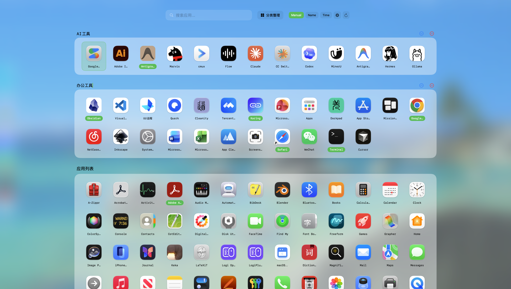
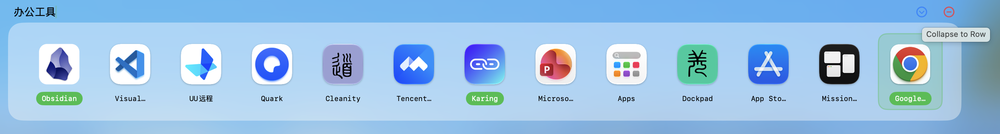
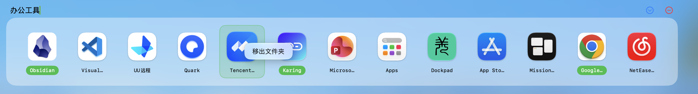
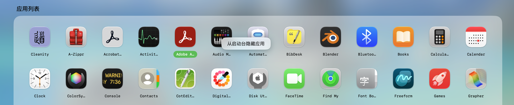
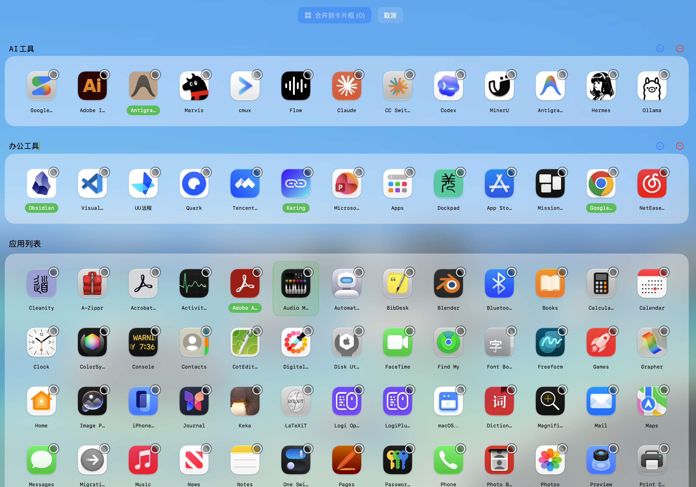
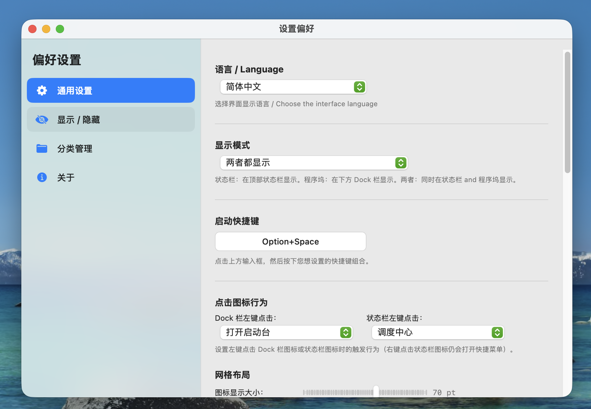
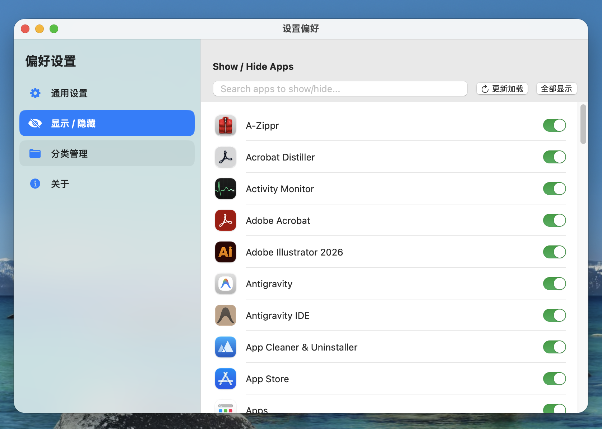
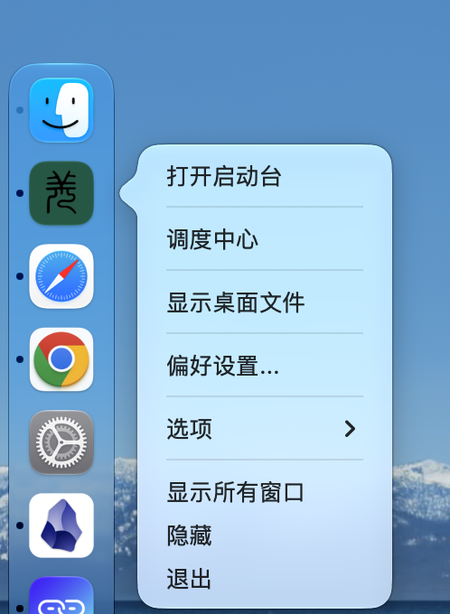
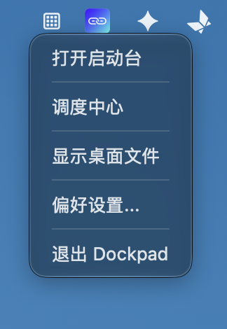

# Dockpad

一款专为 macOS 设计的增强版启动台（Launchpad）与 Dock 栏辅助工具，旨在提升应用管理与多任务切换的效率。

---

## 📸 应用截图 (Screenshots)

### 主界面预览 (Main Interface)

  
  

  
  

  

### 设置与偏好 (Settings & Configuration)

  
  

  
  

---

## ✨ 核心特性

- **高效感知与常驻**：提供比原生 macOS 更加灵活的面板交互。
- **自定义配置**：支持对常驻应用、布局、以及快捷触发方式进行深度定制。
- **轻量原生**：完全使用 Swift 与 Cocoa 框架开发，保证极低的内存占用与丝滑的动画过渡。

## 🚀 安装指南

1. 前往本仓库的 [Releases](https://github.com/SaiWang-Neo/Dockpad/releases) 页面下载最新的 `Dockpad.dmg`（或 `Dockpad.zip`）。
2. 打开安装包，将 **Dockpad** 拖拽至你的 **Applications（应用程序）** 文件夹。
3. 首次打开时，可能需要前往 `系统设置 -> 隐私与安全性` 授予必要的辅助功能权限。

## 🛠️ 开发环境

- **语言**: Swift 5
- **平台**: macOS 13.0+
- **IDE**: Xcode 14.0+

## 📄 开源协议

本项目基于 [MIT License](LICENSE) 协议开源。
